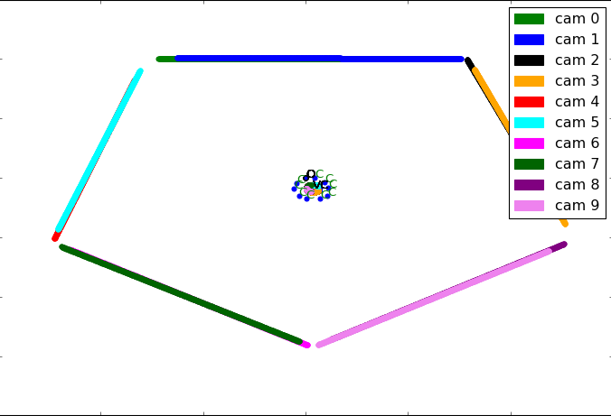
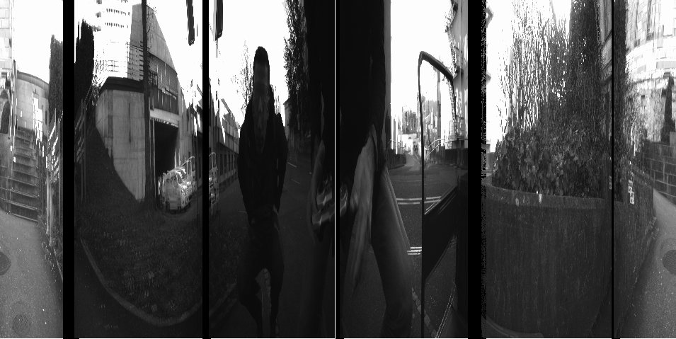
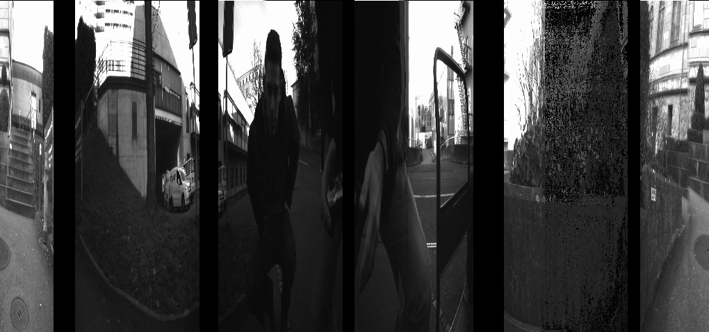
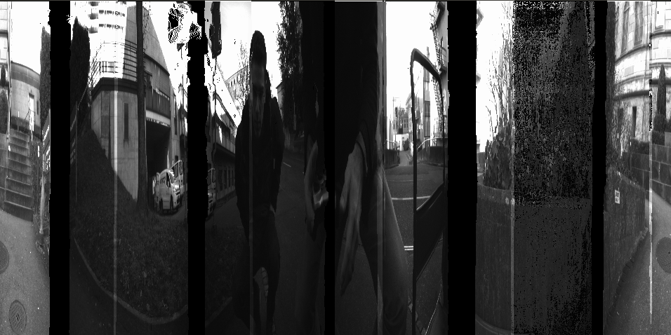
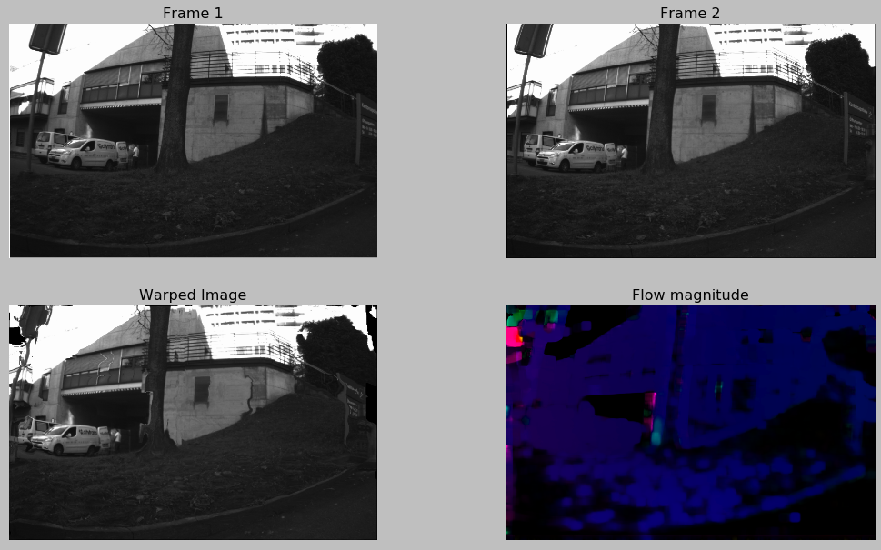
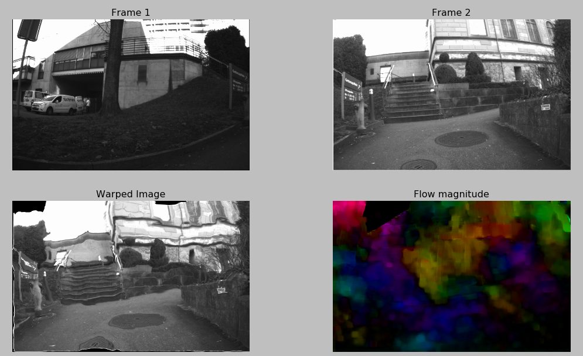
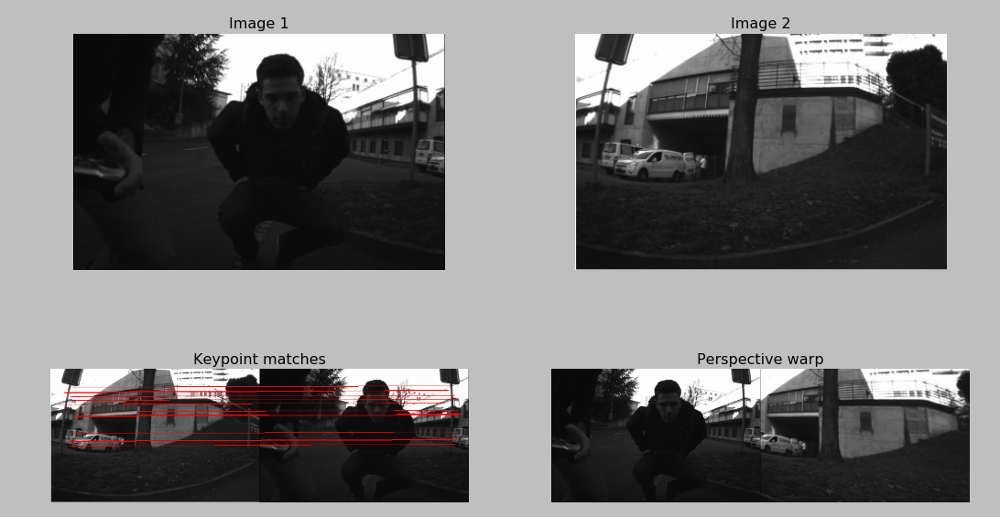
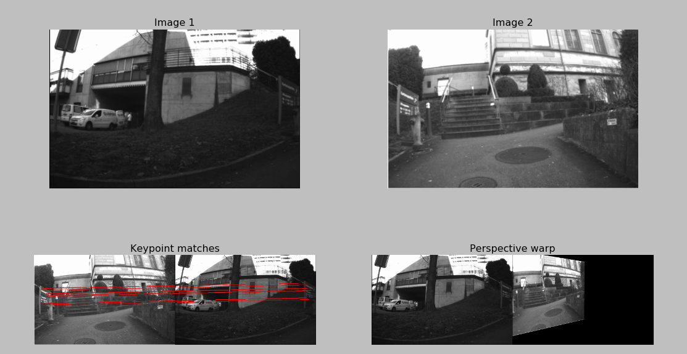
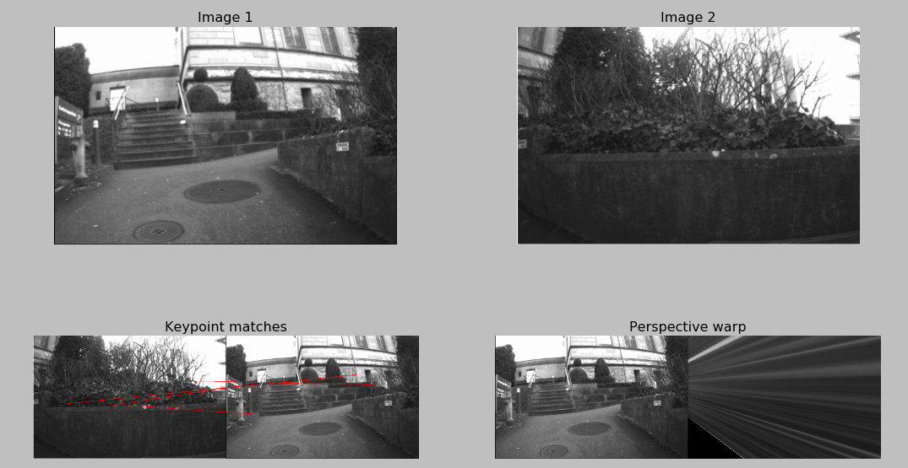

# ODS-for-VR
This repository is an implementation of the omni directional stereo renderer used in 'Jump'; google's framework for 360 degree Virtual reality.

# Camera rig description
The camera rig in our dataset consists of 10 cameras setup as shown below.

Though for ideal ODS rendering, we would like our cameras to be oriented radially outwards from the viewing circle, our rig 
consists of pairs of stereoscopic cameras. The images captured by the rig, as visualized on the 'xz' plane are as shown below. 
Each image plane is shown in a different color. 

We see that the rig is primarily composed of 5 stereo pairs. The overlap between adjacent stereo pairs (cam0-cam1 and cam2-cam3) is very minimal. Therefore, though we have 10 cameras, we predominantly see only 5 image planes resembling a pentagon. 

On mapping these images onto the viewing circle for the left eye, we get the figure below.

## 360 rendering without view interpolation
In the simplest form, after mapping each image to its proper location in the viewing circle, we can directly synthesize an image in 360 without view interpolation. 

## 360 rendering with column wise flow for view interpolation
In this case, we consider the average flow for every column in the image and perform the linear view interpolation proposed by the authors. 

## 360 rendering with pixel wise flow for view interpolation
Here, as opposed to considering only the average flow for every column, each pixel's flow in mapping it to the right location in
the final ODS stitch. 

Likewise, results for the other eye can be rendered easily with our ODS renderer. This can be done by setting the argument 'eye=1'
when calling the function RendererODS.render360WithViewInterpolation(eye=1). 

## Challenges with view interpolation
Given the small baseline between two images within a stereo pair, view interpolation with optical flow is easy. 
However due to the large baseline between adjacent stereo pairs, synthesizing images between adjacent stereo pairs with optical flow is
challenging. This is because when computing the optical flow between two such images, it is almost such that these two images are
two completely different scenes. Hence using optical flow for dense correspondences fails.

This problem is highlighted with the help of the following results. 

Dense optical with opencv's Farneback optical flow technique (Farneback '03) works well when there is a good overlap between 
two scenes. When computing the optical flow between the image captured from cam0 and cam1, the optical flow is pretty accurate.
In the bottom right image, only the horizontal flow's is visualized as it is a measure of the per-pixel disparity.

Optical flow properly estimated between images from cameras 4 and 5. 

However, when we attempt of compute optical flow between the images captured by cam1 and cam2; where there is very low overlap
and therefore the two images look quite different from each other, the optical flow estimate is very wrong. This is as shown 
in the figure below. 

Another instance of bad optical flow; this time between cameras 7 and 4. 

For obtainining correspondences between such wide baseline images, we tried to use standard feature matching techniques such as
those based on SIFT features. We found these methods to be much better at finding correspondences in diverse scenes than the flow based technique. This is shown in the figure below.
### Finding correspondence using SIFT between cameras 7 and 4.

### Finding correspondence using SIFT between cameras 5 and 0.

The problem with this method however is that the correspondences obtained are very sparse to do proper view interpolation. Also, this method of estimating correspondences doesn't seem to always work. For example, look at what happens when the same key point matching 
that works so well for stitching together (cam5 and cam0) and (cam7 and cam4), fails when stitching (cam1 and cam2). 
### Finding correspondence using SIFT between cameras 1 and 2.

In the results that we have shown above, we perform view interpolation only between two images in the same stereo pair; i.e
between images from (cam0, cam1), (cam2-cam3) etc. No iterpolation is performed between (cam1-cam2) because of the problems mentioned
herein.

# Source file descriptions
## Core 
- SJPImage.py : OpenCV image wrapper with additional functionality
- cameras.py : Implements the camera class and all related functionality
- stitcher.py : Implements homography based image stitching
- renderer.py : The JUMP ODS renderer class
- viewSynth.py : OpenCV optical flow wrapper and composting code (To be implemented fully)
- ExposureCorrect.py : Jump exposure correction optimizer
- RayGeometry.py : Implements generic geometry functions

## Applications
- testapp_JumpRendererMain.py : Primary test app
- testapp_homographystitch.py : Simple homography based image stitching
- testapp_exposurecorrect.py : Unit tests for exposure correction
- testapp_denseflowStereo.py : Dense optical flow estimation for spatially separated cameras with opencv
- testapp_denseflow.py : Dense optical flow estimation for an image sequence captured from a single camera
- testapp_opencvOpticalflow.py : Unit tests for optical flow
- testapp_stereomatch.py : Unit tests for triangulation with stereo matching

# Directory structure
- To do

